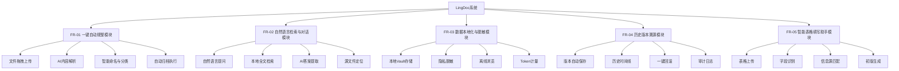

# 灵档（个人版）软件需求说明书

**文档编号**: LingDoc-SRS-001  
**版本**: v1.1  
**编制日期**: 2026-04-17  
**密级**: 内部开放

---

## 1. 引言

### 1.1 编写目的

本文档旨在为灵档（个人版）提供从 MVP 到最终形态的完整、工业级需求规格说明书，为两名兼职开发人员提供清晰的开发蓝图。文档以**最终产品形态**为基准进行描述，同时通过附录说明当前 MVP 阶段与 `docs/ruoyi` 开发规范的适配关系。

### 1.2 项目背景

**项目名称**: 灵档（个人版） / 活档智库  
**英文名称**: LingDoc Personal Knowledge Vault  
**核心理念**: 构建"**数据不出本地，算力按需借用**"的个人文档管理工具

**转型背景**: 从基层政务场景转向个人效率工具，目标用户为：
- 高校教师（教案管理、论文素材）
- 研究人员（文献管理、数据归档）
- 学生（学习资料整理）
- 有表格填写需求的用户（奖学金申请、报销单、报名表等）

### 1.3 术语定义

| 术语        | 英文全称                          | 说明                       |
| --------- | ----------------------------- | ------------------------ |
| **Vault** | Personal Vault                | 本地保险库，存储用户原始文件、脱敏版本及历史快照      |
| **OCR**   | Optical Character Recognition | 光学字符识别，使用 PaddleOCR-json 本地执行 |
| **Token** | AI Computation Token          | AI算力消耗单位，与云端同步余额         |
| **审计日志**  | Audit Log                     | 记录用户操作的不可篡改日志链           |
| **脱敏**    | Desensitization               | 根据正则表达式自动隐藏敏感信息，仅上传脱敏后的内容到 AI 端          |
| **规整**    | Auto-Organize                 | AI 根据文件内容自动生成规范命名并分类归档的过程 |

---

## 2. 总体描述

### 2.1 系统目标

构建一款基于 **Electron + RuoYi-Vue3 + Spring Boot** 的跨平台桌面应用，实现：
1. **一键自动规整**: 拖拽文件即可由 AI 自动命名并归类到相应文件夹
2. **自然语言检索与对话**: 无需记忆文件名，直接以自然语言提问，AI 从文档中提取答案并定位源文件
3. **数据本地化**: 断网也能看，数据仅存储在本地设备；需要 AI 对话时会在本地预先脱敏处理，过程透明
4. **历史版本溯源**: 对同一份文档的每一次修改自动存档，操作可查、可一键撤回
5. **智能表格填写助手**: 上传空白表格，AI 根据本地 Vault 中的已有信息自动生成填写建议与初版内容
6. **算力计费**: 精确计量每次 AI 操作消耗的 Token
7. **审计溯源**: 不可篡改的操作日志，支持完整行为追溯

### 2.2 系统架构

```mermaid
graph TB
    subgraph Electron主进程层
        A[Electron Main Process<br/>Node.js] --> B[
Keytar密钥管理<br/>(Windows Credential<br/>Manager/macOS Keychain)
        ]
        A --> C[
PostgreSQL生命周期管理<br/>(启动/停止/监控)
        ]
        A --> D[
JRE生命周期管理<br/>(启动后端JAR)
        ]
        A --> E[
FileWatcher文件监控<br/>chokidar库
        ]
        A --> F[
System Tray托盘管理<br/>右键菜单
        ]
    end

    subgraph RuoYi-Vue渲染层
        G[Vue3 3.4 + Vite 5<br/>+ Element Plus 2.x] --> H[
Vue Router<br/>页面路由
        ]
        G --> I[
Pinia 2.x状态管理<br/>用户数据
        ]
        G --> J[
Element Plus<br/>UI组件库
        ]
        G --> K[
Axios HTTP客户端
        ]
    end

    subgraph Spring Boot服务层
        L[Spring Boot 3.2.x<br/>Java 17] --> M[
Spring Security + JWT<br/>权限认证
        ]
        L --> N[
MyBatis Plus<br/>ORM框架
        ]
        L --> O[
PostgreSQL 12+<br/>(便携式绿色版)
        ]
        L --> P[
PaddleOCR-json<br/>外部调用
        ]
        L --> Q[
本地Vault存储<br/>%APPDATA%/LingDoc/vault
        ]
    end

    subgraph 通信层
        A <--> |
ipcMain / ipcRenderer<br/>(Electron IPC)
        | G
        K --> |
Axios HTTP<br/>localhost:{动态端口}
        | L
    end

    subgraph 云服务层
        R[MemFire Cloud / Laf] --> |
仅同步Token余额<br/>HTTPS
        | L
        R --> S[
用户身份验证<br/>UUID + Hash密码
        ]
    end

    style A fill:#3f51b5,stroke:#333,stroke-width:2px,color:#fff
    style G fill:#1976d2,stroke:#333,stroke-width:2px,color:#fff
    style L fill:#388e3c,stroke:#333,stroke-width:2px,color:#fff
    style R fill:#f57c00,stroke:#333,stroke-width:2px,color:#fff
```

### 2.3 运行环境

**客户端环境**:
- **操作系统**: Windows 10+, macOS 10.15+, Linux (Ubuntu 20.04+)
- **硬件**: CPU 4核+，内存 8GB+，存储 10GB+
- **依赖**: Node.js 18+, JDK 17+, PostgreSQL 12+ (Portable)

**开发环境**:
- **前端**: Node.js 18, Vue 3.4, Element Plus 2.x, Vite 5.x
- **后端**: Spring Boot 3.2.x, MyBatis Plus, PostgreSQL 12+
- **工具**: Maven 3.8+, Git 2.30+, Docker (可选)

**生产环境**:
- **数据库**: PostgreSQL 12+ (绿色版捆绑，无外部依赖)
- **运行时**: Electron 28+ (内置Node.js 18)
- **部署**: 独立安装包，支持静默升级

---

## 3. 功能需求

### 3.1 功能模块划分



### 3.2 核心业务用例

#### 3.2.1 UC-001: 一键自动规整

**参与者**: 终端用户  
**前置条件**: 应用正常运行，Vault已初始化

**主流程**:
1. 用户拖拽一批文件到应用窗口或点击"上传"按钮
2. 系统计算文件MD5校验和，判断文件类型（图片/PDF/Word/Excel/其他）
3. 如果是图片/PDF，自动触发 PaddleOCR 任务提取文本内容；Word/Excel 直接解析文本
4. 将提取的内容（或脱敏后的内容）上传至阿里千问 API
5. AI 根据文件内容生成**规范文件名**和**推荐分类路径**（如 `/学习资料/大三上/操作系统/实验报告要求.pdf`）
6. 系统在界面向用户展示 AI 推荐的命名和路径，用户可一键确认或手动修改
7. 用户确认后，系统自动将文件重命名并移动到 Vault 的目标文件夹
8. 系统生成唯一 fileId，更新 `file_index` 表，显示归档成功

**后置条件**: 
- 文件已物理存储到 Vault 的目标目录
- `file_index` 表已插入记录
- 如果是图片/PDF，`audit_log` 记录 OCR 任务

**异常流程**:
- E1: 文件已存在（MD5重复）→ 提示用户是否覆盖或跳过
- E2: Vault空间不足 → 提示清理空间
- E3: 文件类型不支持 → 提示错误，仅记录日志不中断其他文件处理
- E4: AI 命名建议生成失败 → 使用原始文件名+时间戳作为备选方案

**技术细节**:
- 使用 RuoYi 的 `@Async` 注解实现异步批量处理
- OCR 线程池: coreSize=2, maxSize=4, queueCapacity=50
- Token 计算: `tokens = 图片像素数 / 1000 * 0.5`

#### 3.2.2 UC-002: 自然语言检索与对话

**参与者**: 终端用户  
**前置条件**: Vault 中已有归档文件及对应的 OCR/解析文本索引

**主流程**:
1. 用户在搜索框用自然语言提问（例如："助教在群里发的那份《实验报告要求》中，最后提交截止时间是什么时候？需要什么格式？"）
2. 系统通过 PostgreSQL 的 **GIN 全文索引**（`tsvector`）在本地检索与问题相关的文档片段
3. 将检索到的相关文本片段（已脱敏）传递给阿里千问 API
4. AI 从文档内容中提取精确答案
5. 系统返回答案文本，同时附带**引用源文件名称**和**定位到源文件的跳转链接**
6. 用户可继续追问，系统自动关联上下文进行多轮对话

**后置条件**:
- `audit_log` 记录检索与对话请求
- Token 余额已扣除

**异常流程**:
- E1: 本地索引中未找到相关文档 → 提示"未找到相关内容，请检查 Vault 中是否已归档该文件"
- E2: AI 无法从文本中提取明确答案 → 返回"文档中未找到明确答案"，但仍展示相关源文件

**技术细节**:
- PostgreSQL 全文检索使用 `to_tsvector('chinese', ocr_text)` + GIN 索引
- 检索结果按 `ts_rank` 排序，取前 5 条最相关片段传给 AI
- 多轮对话上下文存储在本地 `chat_session` 表中

#### 3.2.3 UC-003: 数据本地化与脱敏

**参与者**: 终端用户 / 系统  
**前置条件**: 应用已配置脱敏规则，Vault 已初始化

**主流程**:
1. 所有原始文件、OCR 文本、索引数据仅存储在本地 Vault 目录，**不出本地设备**
2. 当系统需要调用 AI（自动规整、自然语言问答、表格填写）时，先检查是否已有脱敏后的文件/文本
3. 如果没有，触发脱敏服务：根据正则规则匹配并替换敏感信息
4. 将脱敏后的文本/文件片段上传到阿里千问 API，**原始文件始终不上传**
5. 脱敏过程对用户可见透明：用户可在设置中查看/修改脱敏规则，在操作日志中查看脱敏记录
6. 断网环境下，系统切换为**离线模式**：用户可正常浏览本地文件、索引和历史记录，仅 AI 相关功能不可用

**脱敏规则配置**:
- 手机号: `\d{11}` → `138****1234`
- 金额: `\d+\.\d{2}` → `****.**`
- 身份证号: `\d{17}[\dX]` → `1101**********1234`
- 用户可在系统设置中自定义正则表达式

**Token 计费与审计**:

用户触发 AI 操作 → AuditInterceptor 拦截 → 计算 Token 消耗 → 查询余额 → 扣除 Token → 执行操作 → 记录审计日志 → 生成当前日志哈希 → 更新 Token 余额 → 同步到云端

```mermaid
graph TD
    A[用户触发操作: 自动规整/搜索/表格填写] --> B[AuditInterceptor拦截]
    B --> C[计算Token消耗]
    C --> D[查询用户当前余额]
    D --> E{余额是否充足?}
    E -->|不足| F[抛出异常: TOKEN_INSUFFICIENT]
    E -->|充足| G[执行实际操作]
    G --> H[记录审计日志]
    H --> I[生成当前日志哈希]
    I --> J[更新Token余额]
    J --> K[同步余额到云端]
    K --> L[返回操作结果]

    subgraph 哈希链防篡改
        M[prev_hash: 上一条日志SHA256]
        N[current_content: 操作+时间+用户+参数]
        O[current_hash: SHA256(prev_hash + current_content)]
    end
```

**Token 计算规则**:
- OCR: 像素数 / 1000 * 0.5 token
- 文档搜索: 文本长度 / 100 * 0.1 token
- AI 问答/摘要/规整: API 返回的 usage tokens

**Token 同步策略**:
- 本地缓存 Token 余额（内存/本地缓存）
- 每次消耗后，异步同步到云端 MemFire / Laf
- 失败时记录日志，下次启动重试

#### 3.2.4 UC-004: 历史版本溯源

**参与者**: 终端用户  
**前置条件**: 用户已有归档文件

**自动保存版本流程**:
1. 用户在 Vault 中打开一份文档进行编辑
2. 用户点击"保存"或系统自动保存时，系统计算当前文件 checksum
3. 如果 checksum 与上一版本不同，系统自动将该文件存入 `versions/` 子目录作为新版本快照
4. 系统查询 `file_version` 表，获取当前最大 `version_number`
5. 插入新版本记录：`version_number = max + 1`，同时记录操作人、操作时间、操作类型（编辑/重命名/移动）
6. 系统返回版本保存成功

**版本浏览**:
- 用户选中文件，点击"查看历史版本"
- 系统查询 `file_version` 表，按时间线显示版本列表
- 用户可点击任意版本进行预览（只读）
- 用户可对比任意两个版本的差异

**一键回滚**:
- 用户在历史版本列表中点击"回滚到此版本"
- 系统将选定的历史版本复制到当前工作目录
- 在 `file_version` 中插入一条新记录（`version_number` 继续递增），操作类型标记为"回滚"
- **原因**: 保留完整版本历史，不物理删除任何数据

**审计记录**:
- 每次保存、回滚、删除操作均写入 `audit_log`，并通过哈希链校验

#### 3.2.5 UC-005: 智能表格填写助手

**参与者**: 终端用户  
**前置条件**: Vault 中已有可用于信息提取的源文件（成绩单、证书、证明等）

**主流程**:
1. 用户上传一份需要填写的空白表格（如"国家奖学金申请表"，支持 PDF/Word/Excel）
2. 系统解析表格结构，识别待填写的字段名称（如"姓名"、"GPA"、"获奖情况"、"社会实践时间"）
3. AI 分析字段含义，生成需要从 Vault 中检索的信息关键词
4. 系统在本地 Vault 中检索相关信息源（成绩单 PDF、获奖证书扫描件、社会实践证明）
5. 对检索到的信息源执行 OCR/文本解析，提取关键信息（绩点、奖项名称、活动时间）
6. 将字段与提取到的信息进行智能匹配，生成**初版填写内容**和**填写建议**
7. 用户在预览界面核对初版内容，可做细微修改
8. 用户确认后，系统生成填写好的表格文件并保存到 Vault

**后置条件**:
- 生成的新表格文件存入 Vault
- `audit_log` 记录表格填写助手的操作
- Token 余额已扣除

**异常流程**:
- E1: Vault 中找不到匹配的信息源 → 提示用户手动上传相关文件，或仅生成空白表格
- E2: 某些字段无法从现有文件中提取 → 对该字段标记"待手动填写"，其余字段正常填充
- E3: 表格解析失败（文件损坏或格式不支持） → 提示错误，建议用户转换为 PDF 后重试

**MVP 阶段简化策略**:
- 可先实现字段识别 + 手动信息源关联 + 生成建议文本
- 完整版再实现自动信息源检索与匹配

---

## 4. Vault 物理存储结构设计

### 4.1 存储路径规范

**默认路径**:
- Windows: `%APPDATA%/LingDoc/vault/`
- macOS: `~/Library/Application Support/LingDoc/vault/`
- Linux: `~/.config/LingDoc/vault/`

**文件组织规则**:
```
{vault_root}/
├── {user_uuid}/
│   ├── documents/              # 归档文档（按 AI 分类路径组织）
│   │   ├── 学习资料/
│   │   │   └── 大三上/
│   │   │       └── 操作系统/
│   │   │           └── 实验报告要求_20260417.pdf
│   │   └── 申请材料/
│   │       └── 国家奖学金申请表_20260417.pdf
│   ├── versions/               # 历史版本快照
│   │   └── {file_id}/
│   │       ├── 实验报告要求_20260417_v001.pdf
│   │       └── 实验报告要求_20260417_v002.pdf
│   ├── desensitized/           # 脱敏副本
│   │   └── 实验报告要求_20260417_masked.pdf
│   ├── temp/                   # 智能表格助手的临时生成文件
│   │   └── form_draft_20260417_001.docx
│   └── thumbnails/             # 缩略图（快速预览）
│       └── 实验报告要求_20260417_thumb.jpg
└── pgdata/                     # PostgreSQL 便携版数据目录
```

### 4.2 文件命名规范

**原始文件**: `{AI规范命名}_{timestamp}.{originalExt}`

**脱敏版本**: `{AI规范命名}_{timestamp}_masked.{ext}`
- 在原始文件名基础上添加 `_masked` 后缀

**版本文件**: `{AI规范命名}_{timestamp}_v{versionNumber}.{ext}`
- versionNumber: 三位零填充（001, 002...）

**表格助手临时文件**: `form_draft_{timestamp}_{seq}.{ext}`

### 4.3 元数据存储

**主索引表 (PostgreSQL)**: `file_index`
- 存储文件基本信息、路径、状态、checksum、AI 分类路径

**版本表 (PostgreSQL)**: `file_version`
- 存储版本号、快照路径、操作类型、操作时间、checksum

**全文检索加速 (PostgreSQL GIN 索引)**:
```sql
-- 用于自然语言检索
CREATE TABLE file_search_index (
    file_id TEXT PRIMARY KEY,
    vault_relative_path TEXT,
    original_name TEXT,
    checksum TEXT,
    tags TEXT,  -- JSON数组
    ocr_text TEXT,
    tsvector_text TSVECTOR,  -- GIN 全文检索用
    created_at INTEGER
);

CREATE INDEX idx_fts_gin ON file_search_index USING GIN(tsvector_text);
```

**设计理由**:
- PostgreSQL: 同时承担数据完整性、事务一致性和全文检索三重职责
- GIN 索引: 支持 10 万级文档的毫秒级中文全文检索
- 所有元数据与原始文件同机存储，确保数据本地化

---

## 5. 非功能性需求

### 5.1 性能需求

| 指标          | 目标值      | 测试条件                     |
| ----------- | -------- | ------------------------ |
| **OCR处理速度** | ≤5秒/页    | A4图片，300DPI，单线程          |
| **文件自动规整** | ≤10秒/文件 | 含 OCR + AI 命名分类建议          |
| **全文搜索**    | ≤1秒      | Vault内100,000个文档，PostgreSQL GIN 索引 |
| **自然语言问答** | ≤3秒      | 含本地检索 + 阿里千问 API 推理    |
| **表格填写助手** | ≤15秒     | 含表格解析 + 信息源检索 + OCR + 生成 |
| **界面响应**    | ≤200ms   | 普通笔记本（i5, 8GB）           |
| **启动时间**    | ≤5秒      | 包含 Electron 和 Spring Boot 启动 |

### 5.2 安全性需求

**数据安全**:
- 所有敏感数据（API Key、Token）使用系统级密钥链存储（Keytar 封装 Windows Credential Manager / macOS Keychain）
- 用户原始文件不出本地，仅脱敏后的文本片段上传至 AI 端

**审计安全**:
- 采用哈希链设计确保日志不可篡改
- 每条审计记录包含前一记录的 SHA256 哈希
- 验证时可重新计算并比对哈希值

**Token 防伪**:
- 基于"机器码 + 本地余额 + 密钥盐"生成 SHA256 签名
- 每次启动时校验签名，防止用户手动篡改本地数据库余额

**传输安全**:
- 前后端通信使用 HTTP（本地回环，无需 HTTPS）
- 与云端 AI / 计费中台通信时，必须启用 TLS 1.2+

---

## 附录 A：当前 MVP 阶段技术适配

由于项目前期暂时以 `docs/ruoyi` 中的 **Web 前后端分离架构**进行 MVP 技术验证，后续再迁移到最终的 Electron 桌面应用架构，因此在 MVP 阶段需要对以下技术点进行适配：

| 最终架构组件 | 当前 MVP 适配方案 | 依据文档 |
|---------|-----------------|------|
| **Electron 28+ 桌面壳** | 浏览器访问 `http://localhost` | `docs/ruoyi/01-当前项目结构说明.md` |
| **PostgreSQL 12+ 主数据库** | MySQL 8.0+ | `docs/ruoyi/05-后端迁移与启动指南.md` |
| **PostgreSQL GIN 全文检索** | MySQL 全文索引 / 普通 LIKE 查询 | 当前后端使用 MySQL |
| **PaddleOCR-json** | MVP 阶段可延后集成，优先支持文本类文件（txt/docx/xlsx） | 简化 MVP 开发范围 |
| **Keytar 系统密钥链** | 暂用配置文件 / 环境变量存储敏感信息 | Web 环境暂不支持系统密钥链 |
| **Electron IPC 通信** | 纯 HTTP 通信（Axios） | Web 版无 Electron IPC |
| **Vault 本地目录** | 服务器本地文件目录 | 暂通过后端文件服务代理访问 |
| **System Tray 托盘** | 暂不提供 | Web 环境无桌面托盘 |
| **静默升级** | 手动更新前端/后端代码 | Web 版通过重新部署实现 |

### 前端开发规范对照

MVP 阶段所有新增页面和接口必须严格遵循 `docs/ruoyi` 下的规范：
- **页面路径**: `src/views/lingdoc/模块名/index.vue`
- **API 路径**: `src/api/lingdoc/模块名.js`
- **函数命名**: `listXxx` / `getXxx` / `addXxx` / `updateXxx` / `delXxx`
- **权限标识**: 如 `lingdoc:organize:list`、`lingdoc:search:query`
- **路由注册**: 公共路由在 `src/router/index.js` 的 `constantRoutes` 中注册；权限路由通过后端 `sys_menu` 动态下发

### 数据表适配

MVP 阶段可在 MySQL 中创建以下过渡表：
- `lingdoc_file_index` — 文件索引（对应最终 `file_index`）
- `lingdoc_file_version` — 版本记录（对应最终 `file_version`）
- `lingdoc_chat_session` — 对话上下文
- `lingdoc_audit_log` — 审计日志（含哈希链字段）

以上表结构在迁移到 PostgreSQL 时，字段定义基本保持一致，仅需调整全文索引实现方式。
